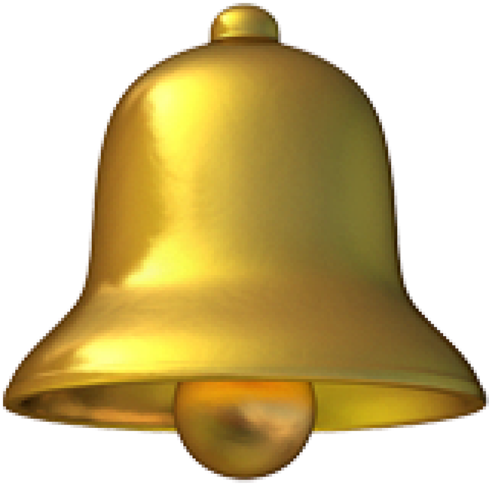

<p align="center">
  
</p>

# SubBark

订阅提醒工具，在到期前通过 Bark 自动向 iPhone 推送通知。

## 截图


## 快速开始

克隆项目：

```shell
git clone https://github.com/qvshuo/SubBark.git --depth=1
cd SubBark
```

复制并编辑配置：

```shell
mkdir -p data
cp subscriptions.example.toml data/subscriptions.toml
```

配置字段说明见 `subscriptions.example.toml` 中的注释。

启动服务，默认运行于 `8080` 端口：

```shell
cp docker-compose.example.yml docker-compose.yml
docker compose up -d --build
```

## 更新配置

修改 `data/subscriptions.toml` 后，重启服务：

```shell
docker compose restart
```
